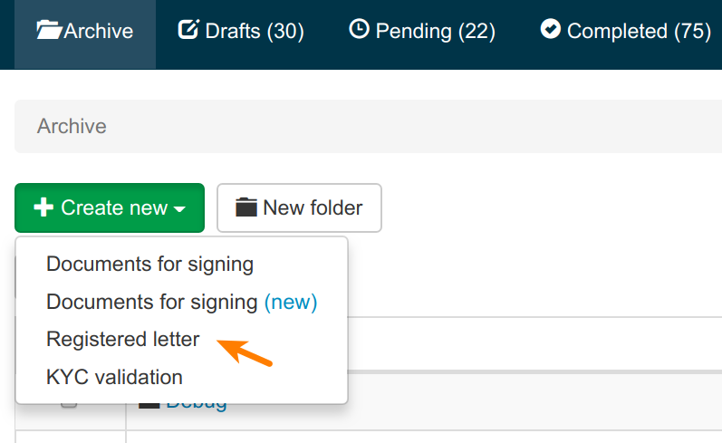

<!-- markdown-toc start - Don't edit this section. Run M-x markdown-toc-refresh-toc -->
**Table of Contents**

- [Example for creating a Registered Letter using the API](#example-for-creating-a-registered-letter-using-the-api)
    - [Prerequisites](#prerequisites)
        - [Enable the feature](#enable-the-feature)
    - [Find the relevant case file type](#find-the-relevant-case-file-type)
    - [Create case file](#create-case-file)
    - [Create document](#create-document)
    - [Create Recipient](#create-recipient)
    - [Send the letter](#send-the-letter)
        - [- Either: Send the letter using Penneo](#--either-send-the-letter-using-penneo)
        - [- Or: Distribute the link yourself](#--or-distribute-the-link-yourself)
    - [Activate the case file](#activate-the-case-file)

<!-- markdown-toc end -->

# Example for creating a Registered Letter using the API

Here is a list of calls that need to be made to the server. Please add the appropriate headers e.g:

```
GET _endpoint_
X-WSSE: _auth_token_
Accept-charset: utf-8
Accept: application/json
Content-Type: application/json
{
    _payload_
}
```

See details on [generating the authentication header using WSSE][doc-auth-wsse]
to add the correct value for the header.

## Prerequisites

### Enable the feature

In order to send out registered letters, you must have a relevant case file
type.

You can verify that this exists for you (i.e. the feature is enabled) by logging
into Penneo and clicking on `Create New`. You should see the option for creating
registered letters as shown below:



If you don't see the option, please contact support@penneo.com and we will create a case file type for you.

## Find the relevant case file type

Assuming that you have a case file type for registered letters e.g. call it
'Anbefalet brev' (Danish), you can find the `id` as follows:

```
GET /api/v1/casefile/casefiletypes

{
  "sdkClassName": "CaseFileTemplate",
  "id": 937,                               <- case file type Id
  "name": "Anbefalet brev",
  "documentTypes": [
    {
      "sdkClassName": "DocumentType",
      "id": 4710,                          <- document type Id
      "name": "Dokument",
      "lowerLimit": 0,
      "upperLimit": 0,
      "signerTypes": []
    }
  ]
},

...

```

## Create case file

```
POST /api/v1/casefiles
{
  "title": "Letter",
  "typeId": 937
}
```

Case file id: `1001`

## Create document
```
POST /documents
{
  "caseFileId": 1001,
  "title": "My document",
  "documentTypeId": 4710,
  "type": "attachment",
  "pdfFile": "base64encoded file" 
}
```

Document id: 2001

## Create Recipient
```
POST /casefiles/1001/signers
{
  "name": "Jane Andersen"
}
```

Recipient id: 3001

## Send the letter

Get the letter (called a `signing request` for legacy reasons).

```
GET /casefiles/1001/signers/3001/signingrequests
```

Letter Id : 3001

Now, you have two options:

### - Either: Send the letter using Penneo

Update the email details:

```
PUT /signingrequests/3001
{
  "email": "jane@acme.com",
  "emailSubject": "You contract is ready to be viewed",
  "emailText": "Dear {{recipient.name}}, Please view the contract using the link: {{link}}. From {{sender.name}}",
  "accessControl": true
}
```

### - Or: Distribute the link yourself

Extract the links:

```
GET /signingrequests/3001/link
```

Once you have the link, you can distribute it yourself. Just make sure that the
case file is active (see below) when the recipient receives the links.

## Activate the case file
```
PATCH /casefiles/1001/send
```

[doc-auth-wsse]: https://github.com/penneo/api-utils/tree/master/doc/auth.md
