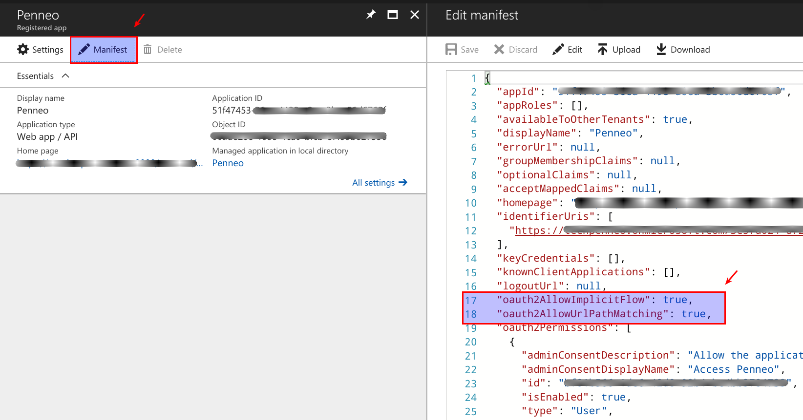
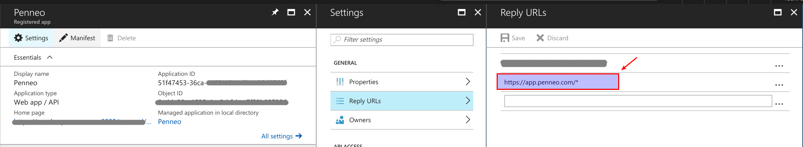
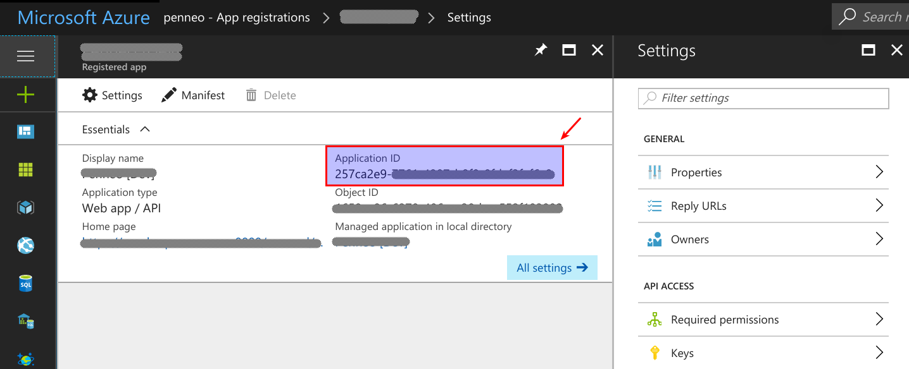

<!-- markdown-toc start - Don't edit this section. Run M-x markdown-toc-generate-toc again -->
**Table of Contents**

- [Using Azure AD with Penneo](#using-azure-ad-with-penneo)
    - [Register an Application that points to Penneo](#register-an-application-that-points-to-penneo)
        - [Update Manifest](#update-manifest)
        - [Configure Reply Urls](#configure-reply-urls)
    - [Share the 'Tenant Id' with Penneo support](#share-the-tenant-id-with-penneo-support)
    - [Setup login URL (local intranet)](#setup-login-url-local-intranet)
        - [How to find the 'Client Id'?](#how-to-find-the-client-id)
- [FAQ](#faq)
    - [What are the default rights when a user is created through Azure AD?](#what-are-the-default-rights-when-a-user-is-created-through-azure-ad)
    - [What are the minimum rights required for users in Azure AD?](#what-are-the-minimum-rights-required-for-users-in-azure-ad)

<!-- markdown-toc end -->

# Using Azure AD with Penneo

## Register an Application that points to Penneo

You have to register an application in you Azure AD. Once that is done, follow these steps:

### Update Manifest
The following flags must be enabled:

- oauth2AllowImplicitFlow
- oauth2AllowUrlPatternMatching

### Configure Reply Urls

The reply url should point to Penneo i.e. https://app.penneo.com/* (or https://sandbox.penneo.com/* when testing withthe sandbox)

## Share the 'Tenant Id' with Penneo support
You have to share your tenant ID with support@penneo.com so that the functionality is enabled for your company

## Setup login URL (local intranet)

Normally, you would use https://app.penneo.com (or https://sandbox.penneo.com
for testing), but when using Azure AD, you have to use a custom URL:

https://app.penneo.com/azuread/login.html?clientId=xxx-xxx-xxx

See below for how you can get the client Id.

### How to find the 'Client Id'?

Once you have registered the Penneo application in Azure AD, you can get the
`clientId` (called the application id in Azure Portal) as shown below:

# FAQ

## What are the default rights when a user is created through Azure AD?
When a new Penneo user is created (due to someone loging in with Azure AD), the
default permissions given to the user in Penneo are 'send documents'. This means
that the user can create case files and send it out for signing but
KYC/Validation process is not included.

The users that are created don't have API credentials enabled. They can only
configure NEMID, BANKID Sweden, or BANKID Norway for their account.

In order to enable the API credentials, the admin of the company can enable
that. You will have to get in touch with support to make someone and admin of
your company.

## What are the minimum rights required for users in Azure AD?
Since, Penneo doesn't fetch data from Azure AD, no rights are required there.
You should be able to use Penneo with the minimum rights. If users can sign in
using Azure AD, that should be enough to use Penneo.
